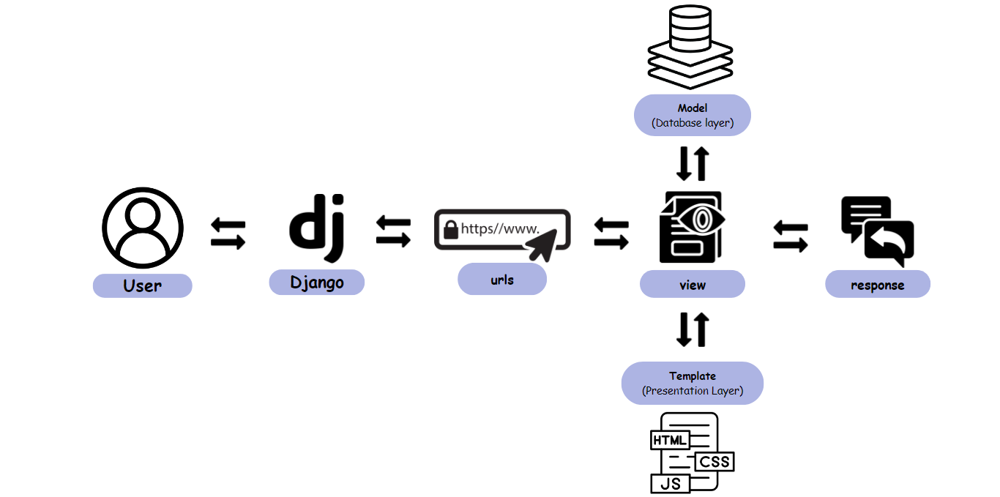
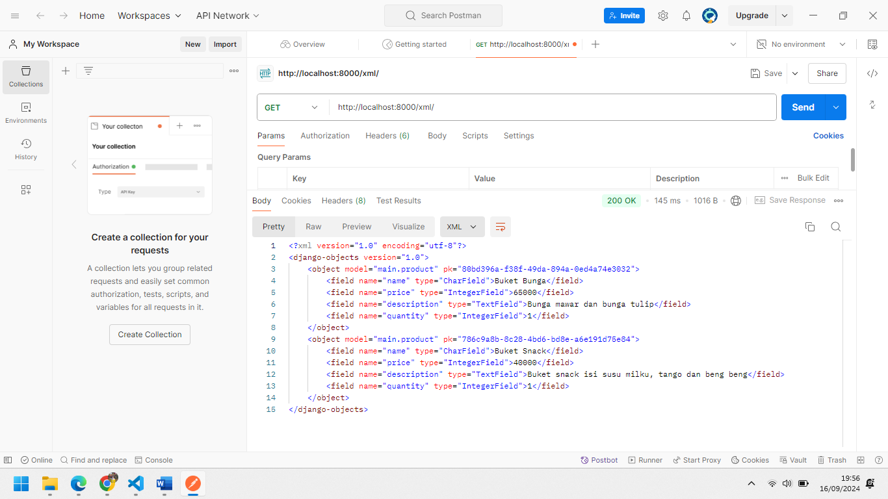
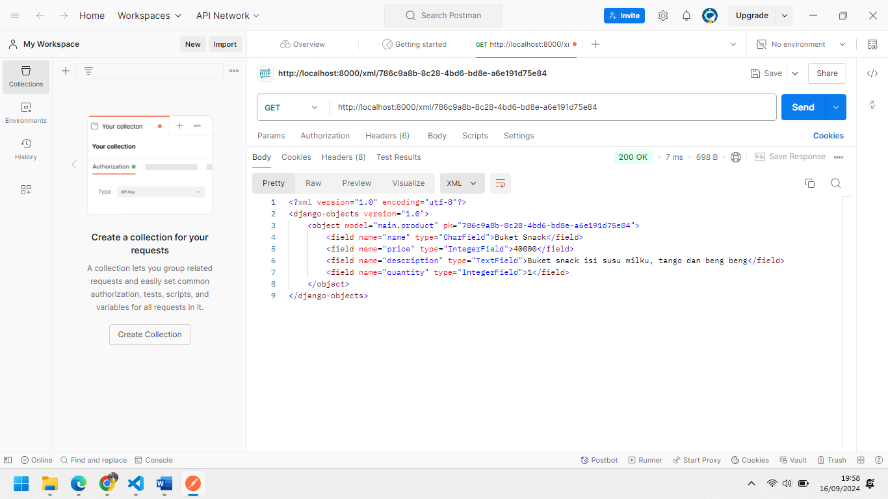
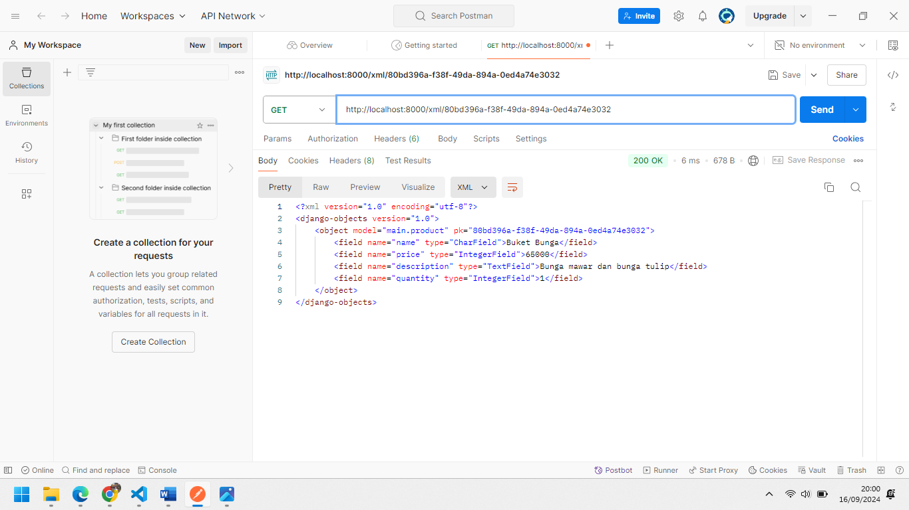
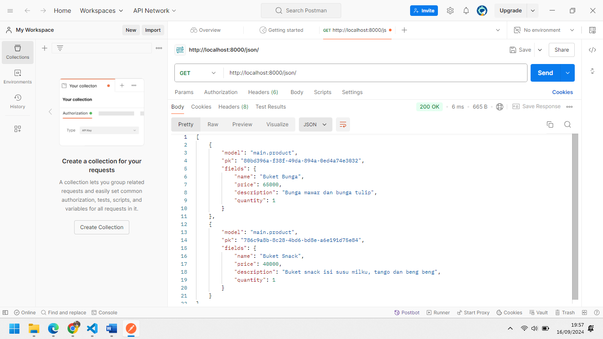
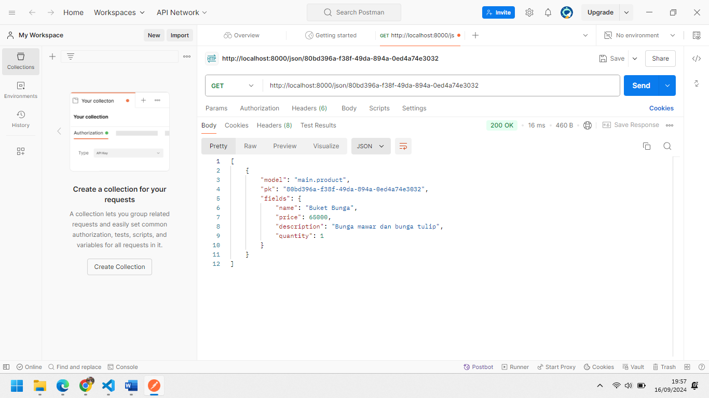
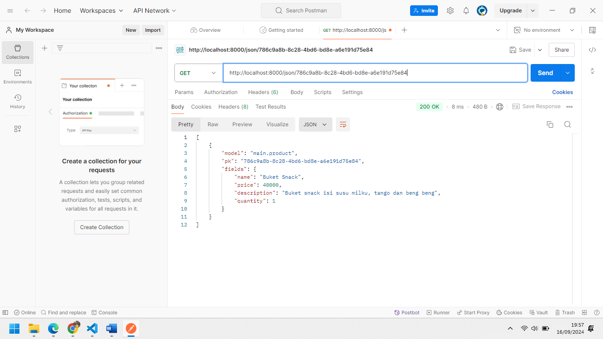

✧˚ ༘ ⋆｡♡˚💐 ***Selamat Datang di Effendy Bouquet*** 💐 ✧˚ ༘ ⋆｡♡˚


Nama: Naila Zakiyyah Effendy
NPM: 2306165793
Kelas: PBP B
link pws --> http://naila-zakiyyah-effendybouquet.pbp.cs.ui.ac.id/

## Tugas Individu 2 PBP 
</details>

### Cara Mengimplementasikan Sesuai _Checklist_
Untuk memulai proyek Django, saya pertama-tama membuat direktori utama dengan nama ```effendy-bouquet``` kemudian menghubungkan repositori lokal dengan repositori di GitHub dan melakukan _cloning_ repositori tersebut ke komputer lokal. Di dalam direktori ini, saya membuat virtual environment menggunakan perintah ```python -m venv env```. Virtual environment ini berguna untuk mengisolasi package dan dependencies proyek, sehingga tidak akan bentrok dengan proyek lain atau sistem Python global. Setelah itu, saya mengaktifkan virtual environment dengan menjalankan ```env\Scripts\activate```.
Kemudian membuat file ```requirements.txt```. Setelah itu menginstalasi _dependencies_ dengan pip ```pip install -r requirements.txt```. Dengan Django terinstal, saya membuat proyek baru dengan nama effendy_bouquet menggunakan perintah ```django-admin startproject effendy_boquet .```.  Dilanjutkan dengan mengubah ```ALLOWED_HOSTS``` di ```settings.py``` untuk keperluan deployment pada direktori ```effendy_bouquet```. Setelah proyek dibuat, saya menjalankan server lokal dengan ```python manage.py runserver``` untuk memastikan bahwa semuanya berjalan dengan baik. Saya kemudian memeriksa aplikasi melalui browser dengan mengakses ```http://localhost:8000```. Setelah memastikan bahwa semuanya berjalan lancar, saya menghentikan server dengan ```Ctrl+C``` dan menonaktifkan virtual environment menggunakan perintah ```deactivate```.


Langkah berikutnya adalah memulai repositori Git untuk proyek saya. Saya melakukan inisialisasi direktori lokal sebagai repositori Git dengan perintah git init. Kemudian, saya membuat file .gitignore untuk mengecualikan file yang tidak perlu dilacak oleh Git, seperti file sementara dan direktori virtual environment. Setelah menyiapkan file ```.gitignore```, saya menambahkan semua file ke repositori dengan ```git add .```, menyimpan perubahan dengan ```git commit -m "Initial commit"```, dan akhirnya mengirimkan berkas ke repositori GitHub menggunakan perintah ```git push```.
Setelah mengatur repositori Git, saya mengaktifkan kembali virtual environment dan membuat aplikasi baru dengan nama ```main``` menggunakan perintah ```python manage.py startapp main```. Saya menambahkan aplikasi main ke dalam daftar ```INSTALLED_APPS``` di file ```settings.py``` proyek, sehingga aplikasi ini terintegrasi dengan proyek utama.


Kemudian, saya mendefinisikan model Product di file ```models.py``` aplikasi ```main```. Model ini memiliki atribut ```name, price, description dan quantity``` yang akan digunakan untuk menyimpan data produk. Setelah membuat model, saya menjalankan perintah ```python manage.py makemigrations``` untuk membuat file migrasi, diikuti dengan ```python manage.py migrate``` untuk menerapkan perubahan ke database.


Selanjutnya, saya membuat template HTML di folder ```templates/main/``` dengan nama ```main.html```, yang berfungsi untuk menampilkan data dari views. Di file ```views.py``` saya mendefinisikan fungsi main yang mengirimkan nama aplikasi, nama saya, dan kelas ke template ```main.html```. Saya memastikan bahwa fungsi ini terintegrasi dengan model jika diperlukan.
Untuk routing, saya mengonfigurasi file ```urls.py``` di aplikasi main untuk mengarahkan URL ke fungsi view main. Saya juga menambahkan routing di file ```urls.py``` proyek utama untuk memastikan bahwa aplikasi main dapat diakses melalui root URL. Setelah semua konfigurasi selesai, saya menjalankan server Django lagi dan memeriksa aplikasi di browser melalui ```localhost``` untuk memastikan bahwa semuanya berfungsi dengan baik.
Terakhir, saya mengikuti petunjuk dari platform PWS untuk melakukan deployment aplikasi. Saya menambahkan URL deployment ke dalam daftar ```ALLOWED_HOSTS``` di file ```settings.py``` dan melakukan push ke PWS mengikuti petunjuk yang diberikan. 

### Bagan yang Berisi _Request Client_ ke Web Aplikasi Berbasis Django Beserta Responnya


Berikut ini adalah deskripsi dari masing-masing langkah dalam alur tersebut:
1.	```Client Request```:Proses dimulai ketika seorang pengguna atau client mengirimkan request ke server melalui browser. Misalnya, mereka mengetikkan URL seperti ```http://example.com/products/```. Request ini berisi informasi tentang URL yang ingin diakses oleh pengguna.
2.	```urls.py```:  Setelah request diterima oleh server, Django pertama kali memeriksa file ```urls.py```. Di sini, Django akan mencocokkan URL yang diminta dengan pola-pola yang telah didefinisikan di ```urls.py```. Setiap URL dipetakan ke fungsi view tertentu. Setelah pola URL yang sesuai ditemukan, request tersebut kemudian diarahkan ke fungsi view yang tepat di views.py.
3.	```views.py```: Fungsi view di ```views.py``` bertanggung jawab untuk menangani logika yang dibutuhkan dalam menanggapi request pengguna. Pada tahap ini, ```views.py``` bisa memproses data yang sudah ada, atau jika diperlukan, ia akan meminta data dari basis data melalui ```models.py```. View juga menentukan data apa yang akan disampaikan ke template untuk ditampilkan ke pengguna.
4.	```models.py```: Jika fungsi view di ```views.py``` membutuhkan data dari basis data, maka ia akan berinteraksi dengan ```models.py```. Model berfungsi sebagai representasi struktur data dan logika bisnis yang berhubungan dengan data tersebut. Dalam ```models.py```, Django akan mengambil atau menyimpan data ke basis data sesuai dengan permintaan view. Setelah data yang dibutuhkan diperoleh, data tersebut akan diteruskan kembali ke ```views.py```.
5.	```Template (HTML)```: Setelah data dikumpulkan atau diproses oleh ```views.py```, langkah selanjutnya adalah mengirim data tersebut ke template. ```Template``` adalah berkas HTML yang telah disiapkan untuk menampilkan data yang diterima dari view. Django mengisi template dengan data yang telah diproses, lalu menghasilkan halaman ```HTML``` yang siap untuk ditampilkan kepada pengguna.
6.	```Response to Client```: Setelah template diisi dengan data yang sesuai, Django mengonversi template menjadi halaman HTML yang lengkap. Halaman HTML ini kemudian dikirim sebagai response kembali ke browser pengguna. Pengguna akan melihat hasil akhir di browser mereka, sesuai dengan data yang telah dikirim dari server.

### Fungsi Git dalam Pengembangan Perangkat Lunak
Git adalah alat penting dalam pengembangan perangkat lunak yang membantu melacak perubahan kode, memungkinkan kerja sama tim, dan menjaga backup dari setiap versi proyek. Dengan Git, pengembang bisa bekerja bersama tanpa saling mengganggu karena mereka bisa membuat cabang (branch) untuk fitur atau perbaikan tertentu. Setiap perubahan yang dibuat dapat dilacak, sehingga jika terjadi kesalahan mereka bisa kembali ke versi sebelumnya. Git juga memastikan transparansi, di mana semua anggota tim bisa melihat siapa yang membuat perubahan dan kapan perubahan itu dilakukan.

### Alasan Framework Django dijadikan Permulaan Pembelajaran Pengembangan Perangkat Lunak

Django adalah framework yang kuat karena ditulis dengan Python, bahasa pemrograman yang mudah dipahami. Python mendukung portabilitas, multi-paradigma, dan memiliki sifat interaktif yang membuat pengembang lebih fokus pada penyelesaian masalah, bukan sekadar sintaksis.

Django dikenal aman digunakan karena fitur keamanan internalnya yang selalu diperbarui, melindungi aplikasi web dari serangan seperti SQL injection dan _cross-site scripting_. Selain itu, Django menyederhanakan proses pengembangan dengan fitur-fitur bawaan seperti URL routing, otentikasi pengguna, dan migrasi skema database. Django juga menganut konsep _KISS (Keep It Short and Simple)_ dan _DRY (Don’t Repeat Yourself)_, yang berarti pengembang harus menulis kode dengan singkat dan jelas, tanpa pengulangan yang tidak perlu.

Framework ini fleksibel dan dapat digunakan untuk proyek kecil hingga besar, serta mendukung lintas platform seperti mobile, komputer, dan tablet. Django juga memiliki template engine bawaan, tapi tetap kompatibel dengan template lain seperti Jinja2. Keunggulan lainnya, Django sudah digunakan secara luas oleh perusahaan besar, pemerintah, dan organisasi di seluruh dunia, baik untuk manajemen konten, sosial media, hingga proyek komputasi ilmiah.

### Alasana Model pada Django disebut Sebagai _ORM_

Django memiliki _Object Relational Mapping (ORM)_ bawaan yang memudahkan pengembang melakukan query database tanpa menulis banyak kode. ORM ini memungkinkan pengembang bekerja dengan database menggunakan objek Python, tanpa perlu menulis query SQL secara langsung. Setiap field dalam class ORM dapat langsung diubah menjadi tabel di database. Dengan ORM, pengembang dapat melakukan operasi ```CRUD (Create, Read, Update, Delete)``` dengan metode berbasis objek, yang mempermudah integrasi antara kode Python dan sistem basis data relasional. Django juga didukung dengan dokumentasi yang lengkap dan jelas, sehingga mudah dipahami bahkan oleh pemula.
</details>


## Tugas Individu 3 PBP
</details>

### Jelaskan mengapa kita memerlukan data delivery dalam pengimplementasian sebuah platform?
Data delivery sangat penting dalam membuat platform karena memungkinkan pertukaran informasi antara pengguna (seperti aplikasi web atau mobile) dan server. Pada umumnya, platform terdiri dari beberapa bagian yang terhubung dan saling bekerja sama. Agar setiap bagian ini bisa saling berkomunikasi, diperlukan data delivery.

Contohnya, ketika pengguna mengirim data (seperti mengisi formulir), server akan menerima data itu, memprosesnya, lalu mengirimkan respons kembali ke pengguna (misalnya, halaman baru atau pesan konfirmasi). Tanpa adanya proses pengiriman data ini, setiap bagian di platform tidak bisa bekerja dengan baik karena mereka tidak bisa berbagi informasi. Jadi, data delivery membantu semua bagian platform berfungsi dengan lancar dan berkomunikasi satu sama lain.

### Menurutmu, mana yang lebih baik antara XML dan JSON? Mengapa JSON lebih populer dibandingkan XML?
Menurut saya JSON lebih baik daripad XML dalam banyak situasi terutama dalam pengembangan apliasi web dan mobile. Berikut alasan mengapa JSON lebih baik:

**1. Sintaksnya Lebih Sederhana**

JSON memiliki struktur yang lebih sederhana dan mudah dibaca oleh manusia. JSON menggunakan kurung kurawal ```{}``` untuk objek dan tanda kurung siku ```[]```untuk array, yang membuatnya ringkas dan jelas. Sebaliknya, XML menggunakan tag pembuka dan penutup seperti ```<tag></tag>```, yang membuatnya lebih panjang dan tidak seefisien JSON.

**2. Ukuran JSON Lebih Kecil**

Karena JSON tidak memerlukan tag pembuka dan penutup yang panjang seperti XML, file JSON biasanya lebih kecil ukurannya. Ini membuat pengiriman data lebih cepat dan hemat bandwidth, yang penting dalam aplikasi web dan mobile yang sering bekerja dengan data dalam jumlah besar.

**3. Lebih Cepat Diproses**

JSON lebih cepat diproses (parsing) dibandingkan XML karena struktur JSON lebih sederhana. Browser modern juga mendukung JSON secara native, sehingga tidak perlu parser tambahan. Ini berbeda dengan XML yang membutuhkan parser khusus untuk memprosesnya.

### Jelaskan fungsi dari method ```is_valid()``` pada form Django dan mengapa kita membutuhkan method tersebut?
Method ```is_valid()``` pada form Django digunakan untuk memeriksa apakah data yang dikirimkan melalui form sudah benar sesuai aturan yang ditentukan, seperti tipe data atau panjang teks. Jika datanya valid, ```is_valid()``` akan mengembalikan True dan menyediakan data yang bersih (cleaned data) untuk diproses lebih lanjut. Kita memerlukan method ini agar aplikasi hanya menerima data yang benar sebelum melakukan hal lain, seperti menyimpannya ke database, sehingga bisa mencegah kesalahan atau potensi masalah keamanan.

### Mengapa kita membutuhkan ```csrf_token``` saat membuat form di Django? Apa yang dapat terjadi jika kita tidak menambahkan ```csrf_token``` pada form Django? Bagaimana hal tersebut dapat dimanfaatkan oleh penyerang?
```csrf_token``` digunakan untuk melindungi form dari serangan CSRF (Cross-Site Request Forgery). Serangan ini terjadi ketika penyerang memanfaatkan sesi pengguna yang sedang login untuk melakukan tindakan tanpa izin, seperti mengirim form tanpa sepengetahuan pengguna, misalnya membuat transaksi atau mengubah data. Jika kita tidak menambahkan ```csrf_token pada``` form di Django, form tersebut bisa menjadi target serangan CSRF. Penyerang dapat mengirimkan permintaan palsu seolah-olah berasal dari pengguna, sehingga bisa menyebabkan masalah serius seperti transaksi ilegal atau perubahan data. Dengan menggunakan csrf_token, kita menambah perlindungan ekstra. Hanya permintaan yang memiliki token valid yang akan diproses oleh server, sehingga mencegah tindakan palsu dari penyerang.

### Jelaskan bagaimana cara kamu mengimplementasikan checklist di atas secara step-by-step (bukan hanya sekadar mengikuti tutorial).

**1. Membuat Skeleton (Kerangka Views)**

Pertama,  membuat folder ```templates``` di dalam proyek Django, dan di dalamnya membuat file ```base.html```. File ini akan menjadi template utama yang berisi bagian-bagian umum seperti struktur HTML dasar yang kemudian bisa digunakan oleh halaman lain.

Di dalam ```base.html```, menambahkan blok-blok kode dengan tag Django seperti `````` yang memungkinkan halaman lain menambahkan konten mereka sendiri. Setelah skeleton ini dibuat, setiap halaman lain akan mewarisi template dasar ini dengan menggunakan perintah extends.

Untuk memastikan Django dapat menggunakan file template, kita perlu menambahkan direktori templates ke dalam pengaturan ```settings.py```.

**2. Menggunakan Skeleton pada Template Lain**

Setelah skeleton selesai kemudian membuat halaman lain seperti ```main.html``` yang ada pada subdirektori templates yang di direktori main (main/templates/). Pada main.html  hanya perlu mengisi blok `````` seperti menampilkan nama toko e-commerce, dan informasi terkait pengguna seperti nama dan kelas.

**3. Mengubah Primary Key dari Integer ke UUID**
   
Untuk meningkatkan keamanan aplikasi Django dan mencegah celah IDOR (Insecure Direct Object Reference) dapat mengubah tipe primary key dari integer menjadi UUID pada ```models.py``` dengan menambahkan import uuid dan pada ```ProductEntry``` diganti ```id``` dengan ```UUID``` kemudian melakukan migrasi.

**4. Membuat Form Input Product Entry**

Secara ringkasnya bagaimana membuat input product entry itu sebegai berikut:

1) Menambahkan ```forms.py``` di direktori main untuk membuat form input data ProductEntry menggunakan field ```"name", "price", "description", "quantity"```.
   
2) Menmbahkan fungsi ```create_product_entry``` di ```views.py``` untuk menangani input form dan menyimpan data ke database. Dan juga mengubah fungsi ```show_main``` ditambahkan fungsi ProductEntry.objects.all() digunakan untuk mengambil seluruh objek ProductEntry yang tersimpan pada database.

3) Menyesuaikan ```urls.py``` untuk mengarahkan ke halaman form input product dengan path create-product-entry.

4) Membuat file ```create_product_entry.html``` untuk menampilkan form input product di halaman web.

5) Di ```main.html``` menambahkan tabel untuk menampilkan data product dan tombol untuk menambah data baru.

6) Setelah semua siap kemudian jalankan server Django dengan perintah ```dengan perintah python manage.py runserver```, menambahkan data baru, dan menampilkan di halaman utama.
   
**5. Menampilkan dan Mengolah Data**
   
Setelah data disimpan di database kemudian ingin menampilkannya di halaman web. Bisa menggunakan query Django untuk mengambil semua data dari model dan kemudian menampilkannya di template.

Di template membuat tabel yang menampilkan setiap entri mood yang sudah disimpan. Jika belum ada data yang disimpan maka akan menampilkan pesan seperti "Belum ada data".

**6. Mengembalikan Data dalam Bentuk XML**

1) Mengembalikan Data dalam Bentuk XML--> Di ```views.py``` impor ```HttpResponse``` dan ```serializers```. Kemduian membuat fungsi ```show_xml``` untuk mengambil semua data dari model ```ProductEntry``` dan mengembalikannya dalam format XML menggunakan serializers. Lalu menambahkan path baru di ```urls.py``` untuk mengakses fungsi ini dengan URL /xml/. Menjalankan proyek, lalu buka browser di URL ```http://localhost:8000/xml/``` untuk melihat hasil dalam format XML.

2) Mengembalikan Data dalam Bentuk JSON --> Membuat fungsi ```show_json``` di ```views.py``` untuk mengambil semua data dari ```ProductEntry``` dan mengembalikannya dalam format JSON menggunakan serializers. Menambahkan path baru di ```urls.py``` untuk mengakses fungsi ini dengan URL /json/. Menjalankan proyek, kemudian buka browser di URL ```http://localhost:8000/json/``` untuk melihat hasil dalam format JSON.

**7. Menampilkan Data Berdasarkan ID**
   
1) Pada file ```views.py``` membuuat dua fungsi baru ```show_xml_by_id``` dan ```show_json_by_id```. Kedua fungsi ini akan menerima parameter id dan mengambil data dari model ```MoodEntry```` berdasarkan ID menggunakan ```ProductEntry.objects.filter(pk=id)```. Untuk fungsi XML, gunakan ```serializers.serialize("xml", data)``` dan kembalikan hasilnya dengan ```HttpResponse(content_type="application/xml")```. Untuk fungsi JSON, gunakan serializers.serialize("json", data) dan kembalikan hasilnya dengan HttpResponse(content_type="application/json").

2) Pada file ```urls.py``` menambahkan path baru untuk mengakses kedua fungsi berdasarkan ID, seperti ```path('xml/<str:id>/', show_xml_by_id, name='show_xml_by_id')``` dan ```path('json/<str:id>/', show_json_by_id, name='show_json_by_id')```.

3) Menjlankan proyek dengan perintah ```python manage.py runserver```. Buka URL seperti ```http://localhost:8000/xml/[id]/``` atau ```http://localhost:8000/json/[id]/``` di browser, di mana ``[id]``` adalah ID dari objek yang ingin dilihat.

**8. Menggunakan Postman**

Langkah selanjutnya untuk menguji endpoint yang kita buat. Kita bisa menggunakan alat seperti Postman. Dengan Postman, kita bisa mengirimkan request ke endpoint XML atau JSON yang sudah dibuat, dan melihat respon data yang dikirim oleh server.

Postman memungkinkan kita melihat apakah data yang kita inginkan sudah ditampilkan dengan benar dan memudahkan pengujian tanpa harus membuat antarmuka pengguna terlebih dahulu.

**9. Deployment dengan GitHub Actions**

Untuk mengotomatisasi push ke PWS menggunakan GitHub Actions, pertama-tama buat direktori ```.github/workflows/``` dalam proyek Django dan tambahkan berkas ```deploy.yml``` yang berisi script untuk mengatur proses push otomatis setiap kali ada perubahan di branch ```main```. 

Selanjutnya, di GitHub, tambahkan secret bernama ```PWS_URL``` pada bagian ```Settings > Secrets and Variables > Actions```, dengan URL PWS yang berisi detail login dan nama proyek. Jangan lupa, update berkas ```settings.py``` dengan menambahkan ```CSRF_TRUSTED_ORIGINS``` yang berisi URL PWS untuk menghindari masalah keamanan.

Setelah itu ```git add```, ```commit```, dan ```push``` ke GitHub. Proses deployment ke PWS akan berjalan otomatis, sehingga tidak perlu melakukan push secara manual ke PWS setiap kali melakukan perubahan di repositori.

### Membuat Screenshot dari Hasil Akses URL pada Postman








</details>


## Tugas Individu 4 PBP
<details>

### Apa perbedaan antara HttpResponseRedirect() dan redirect()

Di Django, ```HttpResponseRedirect()``` adalah kelas yang mengembalikan respons HTTP untuk mengarahkan pengguna ke URL tertentu Jadi kita perlu menyertakan URL secara eksplisit saat menggunakannya, baik itu URL absolut maupun relatif.


Sedangkan pada ```redirect()``` adalah fungsi bawaan Django yang lebih fleksibel karena bisa menerima nama URL, objek model, atau string URL langsung. Fungsi ini memanfaatkan Django URL resolver untuk secara otomatis menemukan path yang benar sehingga lebih efisien dibandingkan menulis URL secara manual.

### Jelaskan cara kerja penghubungan model Product dengan User!

Penjelasan mengenai penghubungan model Product dengan User serupa dengan bagaimana model ```ProductEntry``` dihubungkan dengan User dalam proyek yang kita kerjakan. Model ProductEntry terhubung dengan User menggunakan relasi ```ForeignKey```. Ini memungkinkan setiap objek ```ProductEntry``` memiliki pengguna yang berhubungan dengannya. Misalnya pada model ProductEntry ditambahkan atribut user yang merujuk pada objek User melalui ```ForeignKey```.


Dengan pengaturan ini, setiap product entry yang dibuat pasti akan terkait dengan satu user. Saat sebuah product entry disimpan maka pengguna yang sedang login akan diambil dari request.user dan diisi dalam field user sebelum disimpan ke database. Hal ini memastikan bahwa setiap entry hanya dapat dilihat oleh pengguna yang membuatnya.


Begitu juga untuk Product, model ini bisa dihubungkan dengan User dengan menambahkan ```ForeignKey``` ke dalamnya. Memastikan bahwa setiap produk yang dibuat terasosiasi dengan pengguna yang membuat produk tersebut.


### Apa perbedaan antara authentication dan authorization, apakah yang dilakukan saat pengguna login? Jelaskan bagaimana Django mengimplementasikan kedua konsep tersebut.


```Authentication``` adalah proses memverifikasi identitas pengguna biasanya dengan username dan password untuk mencegah akses tidak sah. ```Authorization``` adalah proses memberi izin kepada pengguna yang sudah terverifikasi untuk mengakses sumber daya atau melakukan tindakan tertentu. Di Django, ```authentication``` dilakukan dengan memeriksa username dan password kemudian membuat sesi menggunakan cookie untuk melacak pengguna yang login. Setelah login, ```authorization``` memastikan apakah pengguna tersebut punya izin untuk melakukan tindakan tertentu, seperti mengakses halaman khusus berdasarkan peran atau izin yang telah ditetapkan.

### Bagaimana Django mengingat pengguna yang telah login? Jelaskan kegunaan lain dari cookies dan apakah semua cookies aman digunakan?


Django menggunakan cookies untuk mengingat pengguna yang sudah login. Ketika pengguna login ke sebuah website berbasis Django, server akan menyimpan informasi login dalam sebuah sesi (session) dan memberikan **session cookie** kepada browser pengguna. Seperti yang dijelaskan oleh BBC, cookies adalah file kecil yang menyimpan informasi dari website dan dikirimkan kembali ke situs tersebut. Django memanfaatkan cookies ini untuk menyimpan informasi sesi pengguna yang login. Setiap kali pengguna mengunjungi halaman yang berbeda di aplikasi Django, **session key** di dalam cookie akan memungkinkan Django untuk mengenali pengguna.

**Kegunaan lain dari cookies**:
- **Menyimpan Informasi Login**: Seperti yang disebutkan sebelumnya, cookies memungkinkan pengguna tidak perlu memasukkan ulang username dan password setiap kali mengunjungi situs.
- **Menyediakan Konten yang Personal**: Cookies dapat mengingat jenis konten atau pengaturan yang dipilih pengguna, sehingga website bisa menyajikan konten yang relevan dengan preferensi pengguna.
- **Menyimpan Pengaturan Website**: Misalnya, cookies bisa menyimpan preferensi bahasa yang dipilih pengguna.
- **Mendukung Keperluan Marketing**: Cookies juga digunakan untuk menampilkan iklan yang relevan berdasarkan aktivitas pengguna di internet.


Secara umum, cookies tidak mengandung malware atau virus karena mereka hanya berupa data pasif yang dikirim bolak-balik antara website dan komputer pengguna. Namun, karena cookies dapat menyimpan informasi pribadi jadi pengguna harus berhati-hati. Informasi di cookies bisa saja dicuri jika pengguna mengunjungi situs yang berbahaya. Oleh karena itu, penting untuk mengelola cookies dengan hati-hati. Kita bisa melakukannya dengan menghapus cookies, mengatur izin situs untuk menyimpan cookies, atau memblokir cookies dari situs yang mencurigakan.

### Jelaskan bagaimana cara kamu mengimplementasikan checklist di atas secara step-by-step


1. Menambahkan Fungsi Register, Login, dan Logout di views.py. Membuat tiga fungsi baru di file views.py yaitu register, login_user, dan logout_user. 

2. Membuat File HTML untuk Login dan Register. Membuat folder login di dalam direktori main/templates. Di dalam folder tersebut membuat file baru yaitu login.html dan register.html untuk halaman login dan registrasi.

3. Di file urls.py kita tambahkan routing untuk fungsi register, login_user, dan logout_user agar pengguna bisa mengakses halaman tersebut melalui URL yang sesuai.

4. Di dalam fungsi login (login_user), setelah validasi form selanjutnya ambil data user dari form dan lakukan login. Tambahkan cookie last_login dengan menyimpan waktu login pengguna. 

```python
if form.is_valid():
    user = form.get_user()
    login(request, user)
    response = HttpResponseRedirect(reverse("main:show_main"))
    response.set_cookie('last_login', str(datetime.datetime.now()))
    return response
```

5. Menambahkan cookie ke konteks di show_main. Di fungsi show_main pada file views.py kita tambahkan nilai last_login ke dalam context.
```python
context = {
    'name': request.user.username,
    'class' : 'PBP B',
    'product_entries': product_entries,
    'last_login': request.COOKIES['last_login'],
}
```

6. Menambahkan foreignKey pada model product. Di file models.py kita buat relasi ForeignKey antara model product dan model User.
```python
class Product(models.Model):
user = models.ForeignKey(User, on_delete=models.CASCADE)
```

7. Melakukan migrasi database. Kita jalankan perintah python manage.py makemigrations dan python manage.py migrate untuk mensinkronkan perubahan database termasuk penambahan relasi ForeignKey.

## Referensi
https://www.geeksforgeeks.org difference-between-authentication-and-authorization/

https://www.totalit.co.id/blog mengenal-cookies-browser-fungsi-bahaya-dan-cara-mengelolanya
</details>
